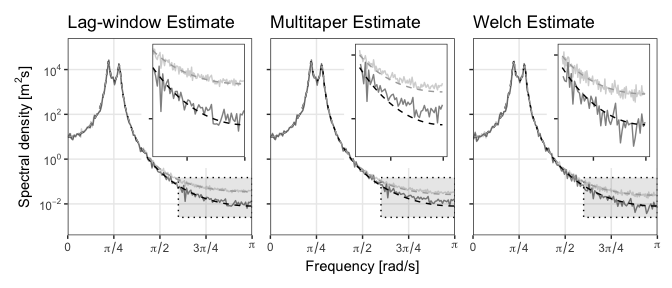

<!-- README.md is generated from README.Rmd. Please edit that file -->

# dquad

This is a support repository for the paper *Bias Correction of Quadratic
Spectral Estimators*. The code is mainly implemented in the
<tt>speccy</tt> package, found
[here](https://github.com/astfalckl/speccy). This package is in active
development to house many modern developments in spectral analsis,
including this body of work. This document replicates the examples in
Figure~1 of the paper to demonstrate implmentation of the methodology.

# Generate data

``` r
# Needed for calculation
library(speccy)

# Needed for this example to obtain the dpss tapers
library(multitaper)

# Handy for data manipulation and plotting
library(tidyverse)
library(latex2exp)
library(patchwork)
```

``` r
overlap <- 0
m <- 2^5
l <- 2^9
k <- l / 4

s <- l * (1 - overlap)
n <- welch_length(m, l, p = overlap)

k <- l / 4

phis <- c(2.7607, -3.8106, 2.6535, -0.9238)
sd <- 1
delta <- 1

sampled_ar <- stats::arima.sim(
    list(ar = phis), n, n.start = 1000, sd = sd
)
```

# Calculate standard spectral estimates

As we detail in the paper, the three broad families of spectral
estimator are multitaper, lag-window and Welch estimates. We demonstrate
the bias correction methodology to each of these estimators, calculated
over the same time-series. First we parameterise the estimators. The
choices of tapers/windows were made so that each estimator exhibited
similar bias.

``` r
# Welch
h <- gsignal::hamming(l)

welch_estimate <- welch(sampled_ar, m, l, s, delta = delta, h = h)

welch_biased_spec <- bochner(
    ar_acf(l, phis, sd), h = h,
    delta = delta, return_ff = FALSE
)

welch_fit <- tibble(
    ff = welch_estimate$ff,
    estimate = welch_estimate$estimate,
    true_spec = ar_spectrum(welch_estimate$ff, phis, sd, delta),
    biased_spec = welch_biased_spec
)

#  Multitaper set-up
slepian_tapers <- dpss(n, 2 * m, m)$v

mt_estimate <- multitaper(sampled_ar, slepian_tapers, delta = delta)

mt_expectation <- multitaper(
  ar_acf(n, phis, sd), slepian_tapers, acf = TRUE, delta = delta
)

multitaper_fit <- tibble(
    ff = mt_estimate$ff,
    estimate = mt_estimate$estimate,
    true_spec = ar_spectrum(mt_estimate$ff, phis, sd, delta),
    biased_spec = mt_expectation$estimate
)

# Lag window set-up
w <- w_daniell(n, 2 * l)

lw_estimate <- lag_window(sampled_ar, delta = delta, lag_sequence = w)

lw_biased_spec <- lag_window(
  ar_acf(n, phis, sd),
  delta = delta, lag_sequence = w, return_ff = FALSE, acf = TRUE
)

lag_window_fit <- tibble(
    ff = lw_estimate$ff,
    estimate = lw_estimate$estimate,
    true_spec = ar_spectrum(lw_estimate$ff, phis, sd, delta),
    biased_spec = lw_biased_spec
)
```

# Calculate bias corrected estimates

Calculating the bias corrected estimates requires two steps. First build
the bases. These are a function only of the parameterisation of the
estimators (time-length, taper/window selection etc). In application,
the bases can be pre-computed for all estimators of a given
parameterisation. The second step is calculating the solution to the
weighted least squares problem, as described in the paper.

``` r
B_welch <- speccy::build_bases(l, k = k, h = h, diff_order = 1)
B_multi <- speccy::build_bases(n, k = k, h = slepian_tapers, diff_order = 1)
B_lag <- speccy::build_bases(n, k = k, lag_sequence = w, diff_order = 1)

dwelch_estimate <- speccy::debias_quad(welch_fit$estimate, B_welch)
dmulti_estimate <- speccy::debias_quad(multitaper_fit$estimate, B_multi)
dlag_estimate <- speccy::debias_quad(lag_window_fit$estimate, B_lag)

dwelch_estimate <- tibble(
  estimate = dwelch_estimate$estimate,
  ff = dwelch_estimate$ff
)

dmulti_estimate <- tibble(
  estimate = dmulti_estimate$estimate,
  ff = dmulti_estimate$ff
)

dlag_estimate <- tibble(
  estimate = dlag_estimate$estimate,
  ff = dlag_estimate$ff
)
```

# Plot results

Finally, we can plot the results. Here, I have used <tt>ggplot2</tt>
which has a habit of being very verbose and so I’ve suppressed the code
in the README. Please consult the raw markdown file if you’d like to
access any of the plotting functions.


